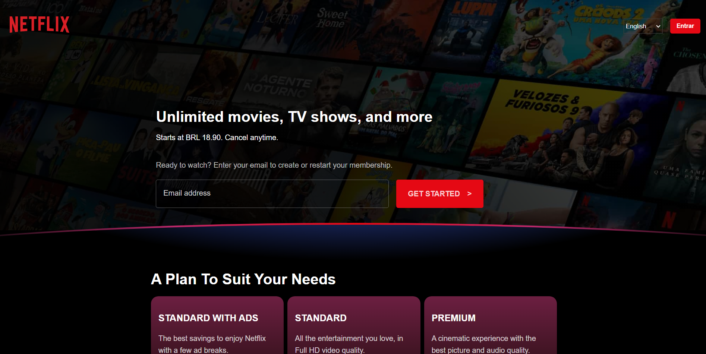

<h1 align="center">
    Netflix UI
</h1>


<nav>
  <ul style="list-style:none;display:flex;justify-content:center;gap:40px;">
    <li>
      <a href="#projeto">Projeto</a>
    </li>
    <li>
      <a href="#tecnologias">Tecnologias</a>
    </li>
  </ul>
</nav>

## 💻 Projeto

O projeto é um clone da Lading Page do Netflix, somente a UI.

Antes de continuarmos, após clonar o projeto, você pode acessar a pasta via linha de comandos e utilizar os seguintes comandos para rodar o projeto: 

```
<!-- acessando a pasta -->
cd {nome da pasta}

<!-- instalando as dependencias do projeto -->
npm install

<!-- rodando o projeto -->
npm run gulp

<!-- rodando o servidor de desenvolvimento -->
npm run dev
```


## 🚀 Tecnologias

Esse projeto foi desenvolvido com as seguintes tecnologias:

- [HTML5](https://developer.mozilla.org/en-US/docs/Web/HTML)
- [SASS](https://sass-lang.com/)
- [JavaScript](https://developer.mozilla.org/en-US/docs/Web/JavaScript)
- [Gulp](https://gulpjs.com/)